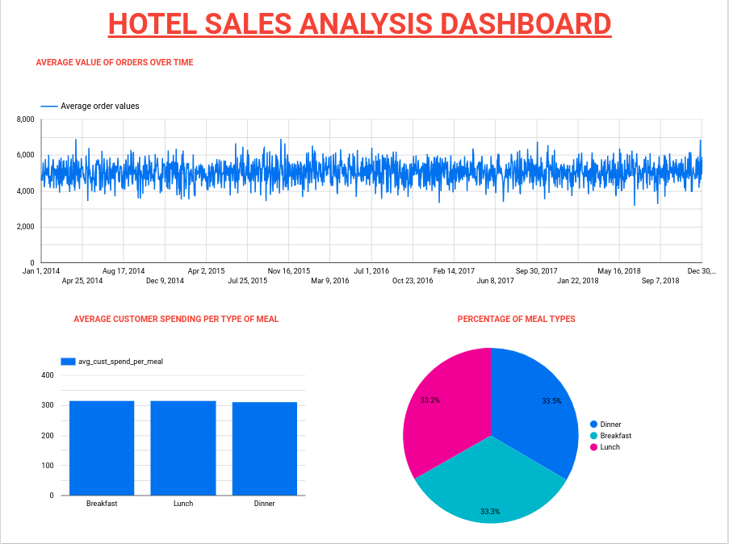

# Data Engineering Project: Hotel Sales Analysis

### Problem Statement
This project aims to analyze ordering, invoicing, and sales processes at a Hotel using this [dataset](https://zenodo.org/records/4092667#.Y8OsBtJBwUE). By delving into customers' meal choices, order values, and conversion rates, this project offers valuable insights into consumer behavior trends and engagement within the business that could facilitate strategic data-driven decision-making. 

The project adopts a *batch* approach and implements cloud-based technologies, data ingestion pipelines, workflow orchestration, data lake, data warehouse, data transformations, and dashboarding.

### Project Architecture

### Cloud
The project is developed in the cloud using scalable infrastructure provided by [Google Cloud Platform](https://cloud.google.com/). Infrastructure as Code (IaC) tools such as [Terraform](https://www.terraform.io/) are utilized to provision and manage the cloud resources efficiently.

### Data Ingestion
Data ingestion involves batch processing, where data is collected, processed, and uploaded to the data lake periodically and subsequently to the data warehouse. This ensures that the latest information on customers' meal choices, order values, and sales conversions is readily available for analysis.

### Workflow Orchestration
An end-to-end pipeline is orchestrated using [Mage](https://www.mage.ai/) to automate data workflows. This pipeline efficiently manages multiple steps in a Directed Acyclic Graph (DAG), ensuring seamless execution and reliability of the data processing tasks.

### Data Lake &  Data Warehouse
In this project, [Google Cloud Storage](https://cloud.google.com/storage) is used as the data lake where the data is initially stored after ingestion from the source. [Google BigQuery](https://cloud.google.com/bigquery) is used as the data warehouse and for storing and optimizing structured data for analysis. Tables in BigQuery are partitioned and clustered to ensure efficient query performance, enabling quick retrieval of insights for strategic decision-making.

### Transformations
Data transformations are performed using [dbt](https://www.getdbt.com/). The transformation logic is defined and executed seamlessly within the pipeline, ensuring accurate analysis of consumer behavior trends and patterns.

### Dashboard

Finally a dashboard is then created using [Looker Studio](https://lookerstudio.google.com/) to visualize key insights derived from the processed data. The dashboard comprises of tiles that provide some insights into the customer actions, habits, and engagement with the hotel.

### How to run the project

##### Prerequisites: 
* Set up a google cloud platform account and provision a virtual machine.
* Create a GCP project and set up service account and authentication as per [these instructions](https://github.com/DataTalksClub/data-engineering-zoomcamp/blob/main/01-docker-terraform/1_terraform_gcp/2_gcp_overview.md#initial-setup).
* Terraform setup in both your local environment and virtual machine. Check out terraform installation instructions [here](https://developer.hashicorp.com/terraform/tutorials/gcp-get-started/install-cli)

#### Instructions: 

__infrastructure provisioning with `terraform`__  

1. Clone this repository `git clone https://github.com/skihumba/data-engineering-project.git` and change directory to the `data-engineering-project` folder.
2. Create a folder named `.keys` in the `1_terraform` folder.
3. Rename your gcp service account key obtained from the second point on the prerequisites to `key.json` and paste it in the `.keys` folder. (if your gcp service account key is in a different location, you have to specify it's location in the `variables.tf` file)
4. Open a terminal and `cd` to the `1_terraform` directory and run the following commands to set up the project infratructure i.e: `google cloud storage` bucket and `BigQuerry`: 
* `terraform init`
* `terraform plan`
* `terraform apply`

__orchestration with `Mage`__

1. Change directory to the `de-project` folder that is in the `2_mage` directory.
2. Create a file named `.env` with the following content: `PROJECT_NAME=de-project` as the name of the mage project.
3. Create a folder named `.keys` in the `de-project` folder.
4. Copy your renamed (`key.json`) gcp service account key into the `.keys` folder. 
5. Run the `docker-compose up` command in the `de-project` folder to startup the mage container.
6. Open mage by going to `localhost:6789` in your browser.
6. In Mage, go to `Files` and edit the `oi_conf.yml` file. Specify the location of the `GOOGLE_APPLICATION_CREDENTIALS` file to be the `.keys` folder created earlier. 
7. Run the pipelines `order_leads_source_to_gcs`, `sales_team_sourde_to_gcs` and `invoices_source_to_gcs` to load data from the source to `google cloud storage`
8. Run the pipelines `order_leads_gcs_to_bq`, `sales_team_gcs_to_bq` and `invoices_gcs_to_bq` to load data from the source to `google cloud storage` to move the data from the datalake (`google cloud storage`) into the datawarehouse (`BigQuerry`)

__transformations with `dbt`__

1. For the transformations, ensure that you have `dbt cloud` set up. You can follow [these instructions](https://github.com/DataTalksClub/data-engineering-zoomcamp/blob/main/04-analytics-engineering/dbt_cloud_setup.md) to set up dbt cloud.
2. import the `2_dbt` folder into your project and run the `dbt-run` command to execute the models as per the transformations specified. 

